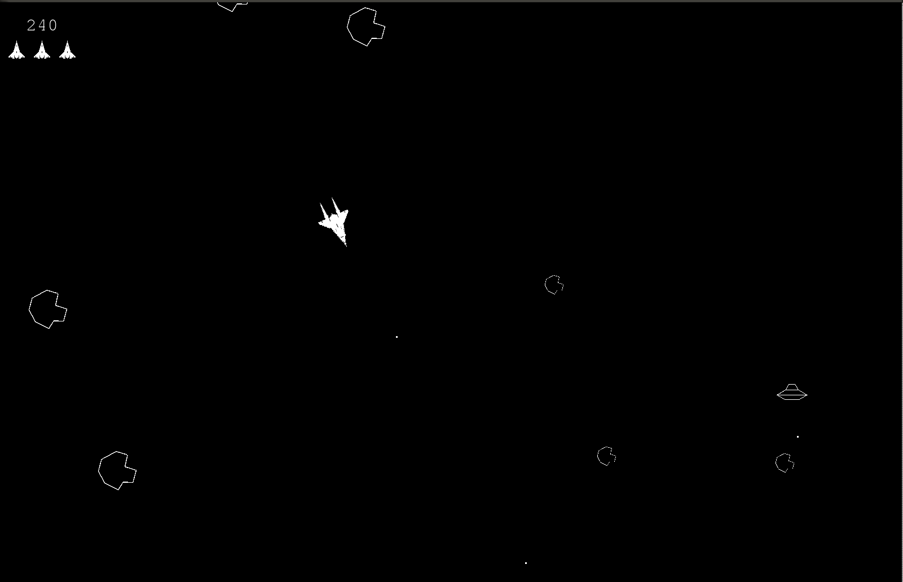

# Project Reflection
### Authors: Corey Cochran-Lepiz, Nathan Estill

## Project Overview

We created a Pygame version of the classic arcade game, Asteroids.

## Results

&nbsp;&nbsp;&nbsp;&nbsp;&nbsp;&nbsp;We ended up with a game that does a good job resembling the original game. The player starts with three lives. They have a ship that moves with an acceleration and turning based system. The ship slows down when not accelerating and can "drift" when turning while going forward. Colliding with asteroids or UFOs, or getting hit by the UFOs projectile makes the player lose a life. The ship shoots a projectile that goes about 5/8 of the size of the screen. Hitting other objects with the ship's projectiles grants points depending on the object. No other interactions grant points. For every 10000 points the player receives, another life is granted.

&nbsp;&nbsp;&nbsp;&nbsp;&nbsp;&nbsp;The asteroids spawn in random places around the map and break up when hit with a non-asteroid object. They break up twice into two more smaller asteroids and disappear on the third hit. Large asteroids are worth 20 points, medium asteroids are worth 50 and small asteroids are worth 100. The UFOs spawn randomly throughout the game. They move in either a straight line or a in a up and down fashion. They shoot in random directions at a distance that is lower than that of the Ship's projectiles. UFOs can shoot asteroids and hit asteroids, but does not grant points if destroyed in this manner. The UFO is worth 500 points.

## Implementation [~2-3 paragraphs + UML diagram]
&nbsp;&nbsp;&nbsp;&nbsp;&nbsp;&nbsp;Our implementation for the non-controllable objects consisted of making a class for each object. Each class had an update function that handled the movement of the object and a destroy function, for when the object was destroyed. The asteroid and UFO had subclasses that inherited them, one for each size of asteroid, and one for each type of asteroid (We had initially planned to add a second type of UFO, but ran out of time). Each of these classes had an overarching class that contained all of the instances of the lower class. This made collision detection much easier and allowed us to simply update the greater class, which in turn updated all of the instances. There was one class that contained all of the objects in the game, holding the overarching classes for each object. This class handled collision detection and updated all of the objects.

&nbsp;&nbsp;&nbsp;&nbsp;&nbsp;&nbsp;On the decision decisions. For the Ship class we decided to go with Pygame's rotation function which was tricky since each time it rotates an image it loses overall quality. Another route we could have gone is making a folder with every angle of the ship inside of it so that all it had to do was pull from the folder when we called for a rotation instead of modifying an image each time.

Class Diagram
* listOfObjects - contains and keeps track of all objects
  * CollectionOfAsteroids - contains and keeps track of all asteroids
    * Asteroid - Base Asteroid class
      * Small Asteroid - Inherits from Asteroid
      * Medium Asteroid - Inherits from Asteroid
      * Large Asteroid - Inherits from Asteroid
  * CollectionOfUFOs - contains and keeps track of all UFOs
    * UFO - Base UFO class
      * BigUFO - Inherits from UFO
      * SmallUFO (not implemented) - Inherits from UFO
  * CollectionOfProjectiles - contains and keeps track of all Projectiles
    * Projectile - Base Projectile class
  * Ship - kept all data for the player
  * GUI - in charge of all user interface realated things 

## Reflection [~2 paragraphs]
<!-- The thing below is to indent. It's HTML basically -->
&nbsp;&nbsp;&nbsp;&nbsp;&nbsp;&nbsp;Looking back at the project we both felt like it was a great success. We feel like the project was scoped well for where our skill levels are. We weren't completely comfortable going into it but at the same time we didn't spend hours on hours debugging code. At the beginning of the project we sat down one dinner with a white board to talk about the overarching design goals we had for the project, written [here](keepInMind.md), which was a great start as it meant we had laid out the project as well as all of the responsibilities. We decided to go with the 'divide and conquer' approach alongside meeting every few days to work next to each other for a few hours which turned out to be an effective strategy for us. We wish we had brainstormed ways to go above and beyond with the project early on so that we could have implemented them from the start. One of the ideas being a two-player Asteroids where one person drives and another aims and shoots a canon.

Looking back, we could have made a lot more of the classes inherit from each other. We could have made a class that was a basic object that moved in space that all of the other objects could have inherited from. We also could have made a class that the could have been a base for all of the 'collection' classes that would have made that part go smoother.
